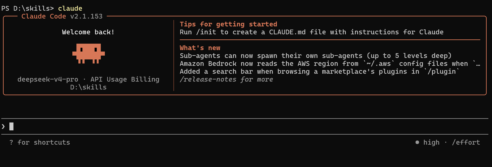
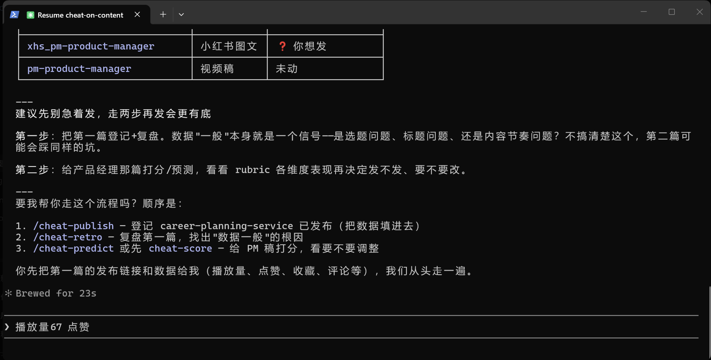
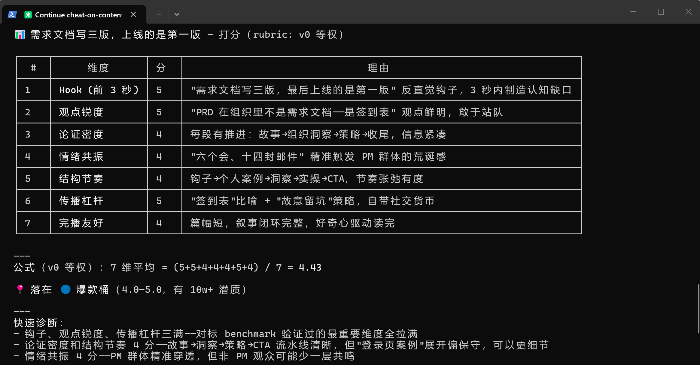
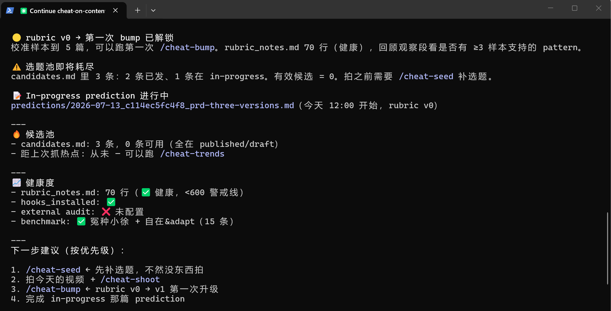
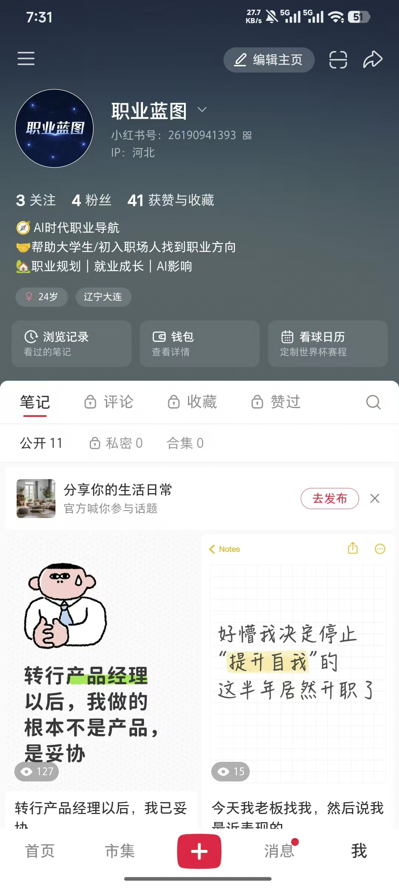

# 职业蓝图 Career-Blueprint
> AI时代职业探索与职业体验平台，告别传统问卷测评，以虚拟岗位任务模拟实现低成本职业试错，面向大学生、转行职场新人解决职业选择迷茫问题。

## 项目简介
市面上传统职业规划产品仅依靠MBTI、霍兰德问卷输出固定推荐，无法让用户感知真实岗位日常工作。**职业蓝图**核心差异化：以「职业地图+岗位模拟器+AI职业复盘」为核心，用户通过完成真实业务场景任务，由AI生成专属岗位体验报告，最终聚合全岗位探索数据生成个人长期职业成长蓝图。

### 核心产品逻辑链路
注册登录 → 浏览行业/职能/职业地图 → 查看岗位详情记录探索进度 → 领取岗位模拟任务 → 完成单选+简答答题 → AI自动生成任务复盘报告 → 累积多岗位探索进度 → 生成专属个人职业蓝图 → 用户提交产品反馈

### 目标用户
1. 在校大学生：不清楚各岗位真实工作内容，选专业、秋招就业迷茫
2. 转行职场新人：无法判断自身适配新赛道，裸辞试错成本过高
3. 内耗职场人：不了解岗位晋升、跨岗迁移路径，缺乏长期职业规划

### 产品核心价值
1. **低成本虚拟试岗**：无需入职、不用裸辞，线上模拟完整岗位工作场景
2. **真实岗位认知**：可视化展示岗位每日工作、必备技能、AI影响程度、成长路线
3. **AI个性化分析**：结合用户全部答题行为输出优势、短板、可落地行动方案
4. **全局职业规划**：聚合多岗位体验数据，生成长期职业发展蓝图

## 技术架构
### 技术栈
- 前端：Vue
- 后端：FastAPI
- 数据库：MySQL + SQLAlchemy ORM
- 数据库迁移：Alembic
- AI服务：大模型接口（任务复盘、职业蓝图生成）
- 鉴权：JWT Token
- 缓存预留：Redis（后续验证码登录拓展）

### 数据库设计
MVP版本P0核心数据表共16张：
`users`、`dicts`、`roles`、`role_functions`、`role_industries`、`skills`、`role_skills`、`tasks`、`task_questions`、`user_sessions`、`task_attempts`、`task_attempt_items`、`attempt_reviews`、`role_exploration_progress`、`career_blueprints`、`feedback_records`

### API接口规范
1. Base URL
   - 本地开发：`http://127.0.0.1:8000/api`
   - 线上环境：`https://career-blueprint.example.com/api`
2. 统一返回JSON结构，内置完整错误码体系（参数错误、登录失效、权限不足、资源不存在、AI服务异常等）
3. 鉴权规则：除注册/登录/公开字典/岗位列表外，所有业务接口需携带`Bearer Token`请求头
4. 接口总量：20个业务接口 + 1个健康检查接口，覆盖用户、岗位、任务、AI复盘、职业蓝图、反馈全模块

## MVP核心功能模块
### 1. 用户账号模块
注册、密码登录、获取当前用户信息、退出登录，自动记录用户会话信息。

### 2. 基础数据字典模块
统一管理行业、职能、题型、探索状态、反馈类型等全局枚举数据，供前端筛选下拉使用。

### 3. 职业地图&岗位探索模块
- 全岗位列表，支持行业/职能/关键词筛选分页查询
- 岗位详情页：一句话介绍、每日工作流程、必备技能、AI影响指数、入门成长路线、关联试玩任务
- 自动记录岗位浏览行为，累计岗位探索进度（浏览20%、完成任务60%、AI复盘100%）

### 4. 岗位模拟器（核心差异化模块）
1. 选择岗位任务，自动抽取总分100分题库（简易单选20分+中等单选30分+简答50分）
2. 实时保存单题答案，防止页面刷新丢失内容
3. 全部题目完成后提交答卷，支持自动触发AI复盘
4. 提交后锁定答案，不可二次修改

### 5. AI复盘模块
基于用户答题内容、岗位背景、任务场景，AI结构化输出：综合得分、能力评级、个人优势、能力短板、改进建议、下一步职业行动。

### 6. 个人职业蓝图模块
聚合用户全部岗位探索记录、所有AI复盘报告，生成综合职业规划方案，包含适配岗位推荐、能力提升路径、长期发展建议，支持查看历史版本蓝图。

### 7. 反馈模块
用户可提交产品内容、功能、体验类反馈，用于产品迭代优化。

## 个人分工说明
本项目中同时承担**产品经理** + **产品运营**双角色，其中重点投入产品运营全链路搭建与落地，依托AI工具实现标准化、可复用、可校准的内容运营体系。

### 一、产品经理工作
1. 需求梳理：输出完整产品PRD，定义产品定位、用户痛点、MVP功能边界，砍掉非核心需求保障项目快速落地
2. 原型设计：使用Axure搭建全页面交互原型，联合ChatGPT完成需求拆解、文案优化与交互逻辑打磨，输出可交付前端的高保真原型
3. 技术方案对接：输出《技术数据方案》，统一接口规范、错误码体系与鉴权逻辑，设计21个前后端交互接口，同步16张核心数据表结构
4. 项目跟进：对接开发团队同步产品逻辑，跟进开发进度，验收功能交付，校验全业务流程闭环

### 二、产品运营工作（核心投入）
围绕小红书平台完成从0到1账号冷启动，基于 **Claude Code + cheat-on-content 内容校准系统** 搭建全流程科学化运营体系，告别凭感觉创作，实现「选题-写稿-预测-发布-复盘-校准」的完整数据闭环。

#### 1. 账号定位与冷启动规划
- 账号定位：AI时代职业导航，面向大学生与初入职场人群，输出职业规划、就业成长、AI职业影响类内容
- 主页搭建：完成头像、昵称、简介全案设计，明确账号价值主张与内容标签，建立专业可信的账号人设
- 冷启动策略：规划搜索型、信任型、互动型、转化型四类内容资产，确定隔日更新的发布节奏，搭建30篇基础内容池的阶段目标

#### 2. 对标调研与内容体系搭建
- 竞品对标：完成赛道内15+标杆账号与爆款内容拆解，覆盖「自在招聘」「Adapt大葡萄」等同类型工具号，提炼爆款规律、用户痛点与可复用内容方向
- 选题库搭建：沉淀5大类内容选题矩阵，包含工具实测、人群痛点、方法论拆解、产品逻辑科普、避坑干货，建立标准化选题池管理机制
- 爆款模板沉淀：总结高表现标题公式、正文结构与封面风格，形成可复用的内容生产模板

#### 3. 基于 Claude Code 的科学化内容生产流
依托 Claude Code v2.1.153 终端环境与 cheat-on-content 技能，搭建「发布前盲预测 + 发布后对账」的内容生产机制，把创作从经验驱动升级为数据驱动。

下图为内容工作流的操作调度面板，统一管理稿件状态、发布登记、复盘校准全流程入口：

**全流程执行链路：**
1. **选题生成（/cheat-seed）**：系统基于对标样本、受众画像自动生成候选选题，遵循「1条稳妥保底 + 1条实验测试」原则，同时监控选题池库存，低于阈值自动预警补全
2. **稿件撰写**：输出完整文案、配图方案，联合GPT完成封面图生成与文案细节优化
3. **7维盲预测打分**：发布前对稿件进行量化评分，7个维度分别为：
   - Hook（前3秒钩子）：开篇认知缺口制造能力
   - 观点锐度：观点鲜明度与站队强度
   - 论证密度：信息紧凑度与内容推进效率
   - 情绪共振：目标人群情绪戳中程度
   - 结构节奏：全文叙事节奏与张弛度
   - 传播杠杆：社交货币属性与自发传播潜力
   - 完播友好：篇幅控制与叙事闭环完整度

下图为单篇稿件的完整打分详情，包含维度得分、理由说明、综合分计算与爆款等级判定：

4. **表现分级预判**：根据综合得分归入爆款桶、优质桶、普通桶、预警桶，给出流量区间概率分布与反事实分析，提前判断内容潜力、决定是否调整优化
5. **稿件状态管理**：统一管理图文稿、视频稿状态，维护发布 buffer 队列，通过颜色预警保障更新节奏稳定，避免断更与内容积压

#### 4. 数据复盘与评分模型迭代
建立 T+3 数据复盘机制，用真实数据反向校准评分模型，持续提升预测准确率。系统自动监控选题库存、模型健康度，并触发公式升级提示。

- **复盘维度**：拆分曝光、点击率、收藏率、评论率、关注率五层指标，定位内容表现优劣的核心原因
- **对账机制**：将真实数据与发布前预测做比对，标记被验证/被推翻的假设，沉淀为校准信号
- **模型升级（/cheat-bump）**：每积累5篇有效样本，触发一次评分公式升级。升级需通过「全量历史重打 + 跨模型盲审」双重校验，确保新公式与实际表现排序一致，实现 rubric 从 v0 到 v1、v2 的持续迭代
- **沉淀输出**：每次复盘输出「保留项/停止项/测试项」三类动作，指导下一轮内容优化，避免重复踩坑

#### 5. 阶段性运营成果
下图为项目配套小红书官方账号主页，已完成从0到1冷启动搭建：

- 完成小红书账号从0到1搭建，冷启动期发布11篇笔记，覆盖产品经理职场感悟、职业成长方法论等方向
- 搭建完成完整的 cheat-on-content 运营工作流，落地盲预测、T+3复盘、模型校准全套机制
- 完成 rubric v0 评分体系搭建，积累首批校准样本，触发第一轮公式升级，为后续内容规模化生产提供数据支撑
- 沉淀对标账号库、选题库、标题模板库等可复用运营资产，形成可复制的AI赋能内容运营方法论

## 产品差异化优势
区别传统问卷测评：不靠性格打分，以真实岗位任务模拟判断适配度，结果更贴合真实职场
AI 深度贯穿全流程：任务答题自动复盘、多岗位数据聚合生成职业蓝图，提供个性化可落地行动方案
轻量化低成本试错：学生 / 转行人群无需承担跳槽、实习时间成本，线上一站式体验全主流互联网岗位
完整职业成长链路：岗位工作内容 + 技能要求 + AI 影响 + 晋升路线一站式展示，清晰职业长期发展路径

## 后续规划
### 产品迭代
拓展 AI 导师功能，支持用户自由提问职业问题，结合个人体验数据输出专属解答
新增手机号验证码登录，扩充岗位题库覆盖更多行业岗位
完善职业成长路线模块，配套学习资源与实战任务推荐
### 运营迭代
持续优化内容评分模型，提升爆款预测准确率
扩充内容矩阵，覆盖更多职业人群与细分场景
搭建私域转化链路，沉淀用户案例，实现内容 - 产品 - 用户的正向循环
